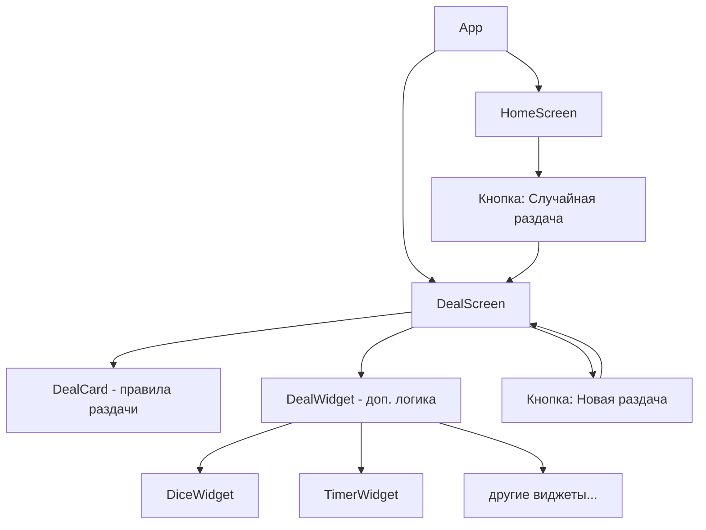

# Дурацкий Покер — План разработки

## Обзор проекта

PWA-приложение на React + TypeScript без бекенда. Оптимизировано для горизонтального режима на iPad/телефоне и ноутбуке. Добавляется на рабочий стол как нативное приложение.

---

## Цветовая палитра

| Роль              | Hex       |
| ----------------- | --------- |
| Фон               | `#12121a` |
| Текст             | `#ffffff` |
| Акцент            | `#fa6400` |
| Карточка/подложка | `#262630` |
| Серый второй      | `#1e1e28` |

---

## Архитектура приложения



---

## Структура файлов

```
stupid-poker/
├── public/
│   ├── manifest.json          # PWA манифест
│   ├── icons/                 # Иконки для PWA
│   └── index.html
├── src/
│   ├── config/
│   │   └── deals.ts           # Конфиг всех раздач
│   ├── components/
│   │   ├── HomeScreen/
│   │   │   ├── HomeScreen.tsx
│   │   │   └── HomeScreen.module.css
│   │   ├── DealScreen/
│   │   │   ├── DealScreen.tsx
│   │   │   └── DealScreen.module.css
│   │   ├── DealCard/
│   │   │   ├── DealCard.tsx
│   │   │   └── DealCard.module.css
│   │   └── widgets/
│   │       ├── DiceWidget/
│   │       │   ├── DiceWidget.tsx
│   │       │   └── DiceWidget.module.css
│   │       ├── TimerWidget/    # пример будущего виджета
│   │       └── index.ts        # реестр виджетов
│   ├── hooks/
│   │   └── useRandomDeal.ts
│   ├── types/
│   │   └── deal.ts
│   ├── App.tsx
│   ├── main.tsx
│   └── index.css              # глобальные стили + CSS-переменные
├── package.json
├── tsconfig.json
└── vite.config.ts
```

---

## Типы данных

### `src/types/deal.ts`

```ts
// Тип виджета — расширяемый union
type WidgetType = 'dice' | 'timer' | 'wheel' | string;

interface DealWidget {
  type: WidgetType;
  props?: Record<string, unknown>; // параметры для конкретного виджета
}

interface Deal {
  id: string;
  title: string; // название раздачи
  description: string; // текст правил
  widgets?: DealWidget[]; // опциональные интерактивные виджеты
}
```

---

## Конфиг раздач (`src/config/deals.ts`)

Пример структуры:

```ts
export const deals: Deal[] = [
  {
    id: 'hollywood-smile',
    title: 'Голливудская улыбка',
    description:
      'Всю раздачу игроки должны улыбаться. Игрок может 1 раз попросить дилера убрать ненужную карту из колоды.',
  },
  {
    id: 'dice-deal',
    title: 'Бросок кубика',
    description:
      'Перед началом раздачи каждый игрок бросает кубик. Выпавшее число — количество фишек, которые нужно поставить в банк.',
    widgets: [{ type: 'dice', props: { sides: 6 } }],
  },
  // ... другие раздачи
];
```

---

## Экраны

### HomeScreen

- Логотип / название «Дурацкий Покер»
- Большая кнопка **«Случайная раздача»** (акцентный цвет `#fa6400`)
- Анимация при нажатии (пульс/свечение)

### DealScreen

- Название раздачи (крупный заголовок)
- Текст правил (карточка на фоне `#262630`)
- Блок виджетов (если есть в конфиге)
- Кнопка **«Ещё раздача»** — выбирает новую случайную (не повторяя предыдущую)
- Кнопка **«На главную»**

---

## Система виджетов

Виджеты — это независимые React-компоненты, которые рендерятся динамически по полю `type` из конфига раздачи.

### Реестр виджетов (`src/components/widgets/index.ts`)

```ts
import { DiceWidget } from './DiceWidget/DiceWidget';

export const widgetRegistry: Record<string, React.ComponentType<any>> = {
  dice: DiceWidget,
  // timer: TimerWidget,
};
```

### DiceWidget

- Отображает кубик (SVG или emoji)
- При клике — анимация броска + случайное число от 1 до N (настраивается через `props.sides`)
- Показывает результат крупно

---

## PWA-конфигурация

### `public/manifest.json`

```json
{
  "name": "Дурацкий Покер",
  "short_name": "Покер",
  "display": "standalone",
  "orientation": "landscape",
  "background_color": "#12121a",
  "theme_color": "#12121a",
  "start_url": "/",
  "icons": [...]
}
```

### `index.html`

- `<meta name="apple-mobile-web-app-capable" content="yes">`
- `<meta name="apple-mobile-web-app-status-bar-style" content="black-translucent">`
- `<meta name="viewport" content="width=device-width, initial-scale=1, viewport-fit=cover">`

---

## Технологический стек

| Инструмент      | Версия | Зачем                         |
| --------------- | ------ | ----------------------------- |
| React           | 18+    | UI                            |
| TypeScript      | 5+     | типизация                     |
| Vite            | 5+     | сборка, dev-сервер            |
| CSS Modules     | —      | изолированные стили           |
| vite-plugin-pwa | —      | PWA манифест + service worker |

---

## Задачи реализации

- [ ] Инициализация Vite + React + TS проекта
- [ ] Настройка глобальных CSS-переменных и сброса стилей
- [ ] Настройка PWA (manifest, meta-теги, vite-plugin-pwa)
- [ ] Создание типов (`src/types/deal.ts`)
- [ ] Создание конфига раздач (`src/config/deals.ts`) с 10+ раздачами
- [ ] Хук `useRandomDeal` для случайного выбора без повторений
- [ ] Компонент `HomeScreen`
- [ ] Компонент `DealScreen` + `DealCard`
- [ ] Реестр виджетов (`src/components/widgets/index.ts`)
- [ ] Компонент `DiceWidget` с анимацией
- [ ] Навигация между экранами (useState или react-router)
- [ ] Адаптивная вёрстка (landscape, safe-area-inset)
- [ ] Финальная полировка анимаций и стилей

---

## Расширяемость

Для добавления новой раздачи с кастомной логикой нужно:

1. Добавить объект в `src/config/deals.ts` с нужным `widgets`
2. Создать новый компонент виджета в `src/components/widgets/`
3. Зарегистрировать его в `src/components/widgets/index.ts`

Больше ничего менять не нужно — система подхватит автоматически.
